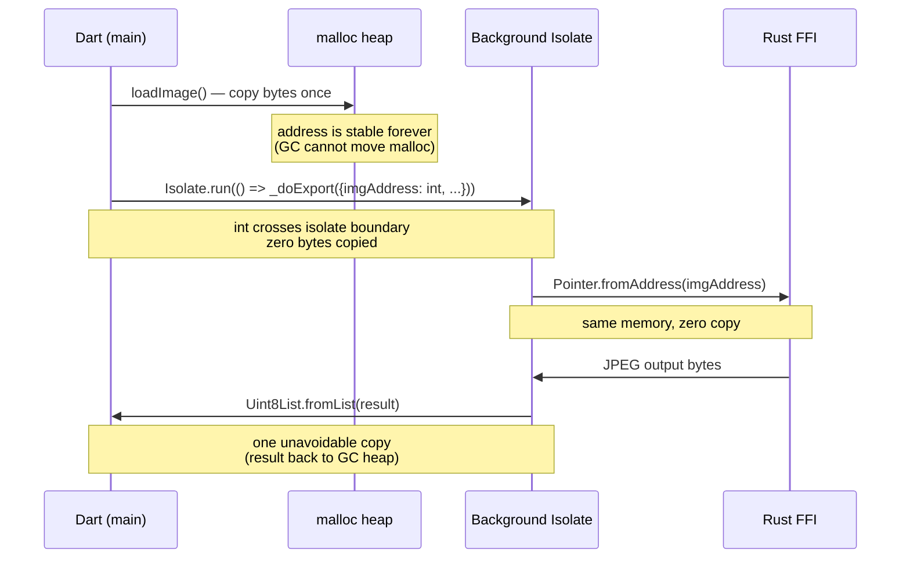
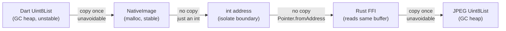
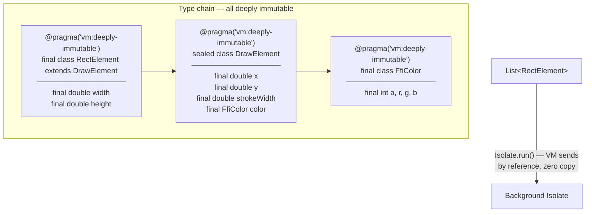
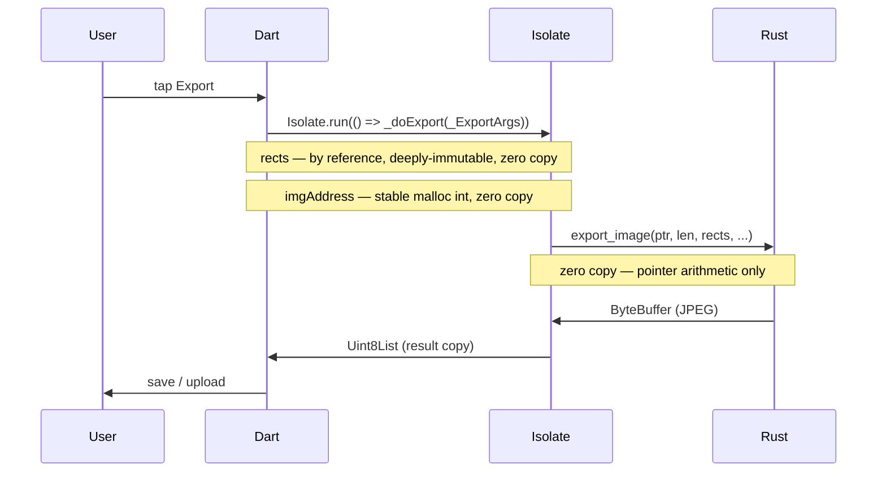

# frigatedraw

Dart workspace for geometric image annotation with Rust-powered export.

## Packages

| Package                       | Description                                                            |
| ----------------------------- | ---------------------------------------------------------------------- |
| [`frigatebird`](frigatebird/) | Pure Dart FFI core — models, commands, Rust build hook, export backend |
| [`frigatedraw`](frigatedraw/) | Flutter UI layer — `DrawEditor`, `DrawPainter`, `DrawController`       |

User provides an image, draws geometric overlays (move, resize via 8 handles), and exports the final
bitmap with overlays baked in. Preview is Flutter Canvas, export via Rust.

## Performance Architecture: Zero-Copy Export Pipeline

Two complementary techniques eliminate redundant copies when passing data
between Dart and Rust via FFI.

---

### 1. Source image: one copy on load, zero copies on export

Dart SDK [GitHub Issue](https://github.com/dart-lang/sdk/issues/51632).

**The problem:** A Dart `Uint8List` lives on the GC-managed heap.
The GC can relocate it at any time — passing its address to Rust is unsafe.
There are only two escape routes, and neither gives us everything:

| Approach                                     | No copy              | GC not frozen        |
| -------------------------------------------- | -------------------- | -------------------- |
| `malloc` + stable pointer **(our approach)** | :x: one copy on load | :white_check_mark:   |
| `isLeaf: true` FFI call (GC frozen)          | :white_check_mark:   | :x: blocks UI thread |
| **Both at once**                             | **impossible**       | **impossible**       |

**Our solution: `NativeImage`** — copy once into `malloc` on `loadImage()`,
then pass only a stable `int address` on every subsequent `export()`.



**Total copies in the full pipeline:**



**Two copies total** — the minimum physically possible — regardless of image
size or how many times the user taps "Export".

---

### 2. Overlay elements: zero-copy isolate transfer via `@pragma('vm:deeply-immutable')`

**The problem:** `Isolate.run()` runs in a background isolate. Sending a
`List<RectElement>` normally triggers a full deep copy of every object.

The naive fix is to serialize everything into a `Float64List` before sending.
That works but loses type safety and adds boilerplate.

**Our solution:** mark the entire type chain as deeply immutable.
The Dart VM then shares the list across isolates **by reference — zero copies**.



> **Rule:** every field in the entire graph must be a primitive or another
> `@pragma('vm:deeply-immutable')` type. One mutable field anywhere breaks
> the guarantee and forces the VM back to copying.

---

### Combined export flow



The source image and overlay data reach Rust with **zero redundant copies**
after the initial `loadImage()` call.

---

## Testing

Each package is tested independently. Prerequisites: [FVM](https://fvm.app) (pins the Flutter / Dart
SDK), the Rust toolchain from `frigatebird/rust/rust-toolchain.toml`, and optionally
[DCM](https://dcm.dev/) for the extra lints.

### `frigatebird` — pure Dart

```bash
cd frigatebird

fvm dart analyze                                    # analyzer (lints)
fvm dart test                                       # unit tests + FFI integration tests
fvm dart format .                                   # formatter (no-op on clean code)
```

The very first `fvm dart test` invocation triggers the build hook and compiles the Rust crate for
the host platform — later runs are cached. No extra Rust command needed to exercise the FFI path
from Dart.

### `frigatedraw` — Flutter UI layer

```bash
cd frigatedraw

fvm flutter analyze                                 # analyzer (lints)
fvm flutter test                                    # widget + controller tests
fvm dart format .                                   # formatter (no-op on clean code)
```

Run the example app interactively:

```bash
cd frigatedraw/example
fvm flutter run                                     # pick a device from the Flutter chooser
```

### `frigatebird/rust` — Rust crate

```bash
cd frigatebird/rust

cargo test                                          # unit tests + golden image tests
cargo clippy --all-targets --all-features -- -D warnings   # strict lints
```

Golden images live in `tests/golden/`. On the very first run (or after intentionally regenerating)
each `golden_*` test **panics with a clear message and writes the golden to disk** — inspect the
PNG visually, commit it, and re-run. Subsequent runs pixel-compare exactly (tolerance 0).

### Workspace-wide quality gate with [DCM](https://dcm.dev/), optional but recommended

```bash
# from the repo root
dcm analyze .                                        # dart_code_metrics across both packages
```
